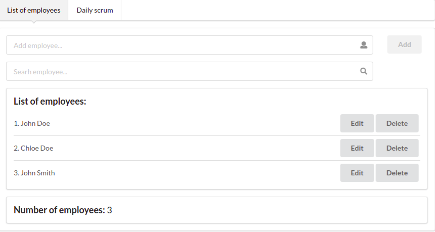
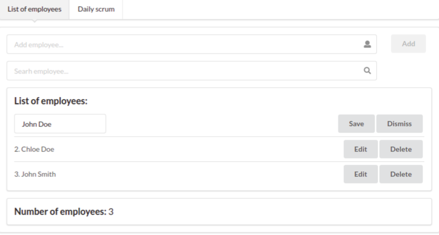
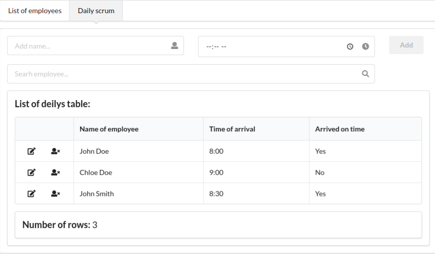
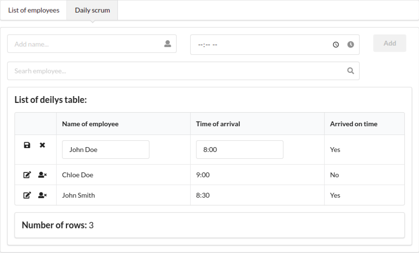

# WALTER

1. Download
2. npm install
3. npm start

<a href="https://walter-angular-ng-rx.vercel.app/">Click Here</a>

## Employees page

## Employees edit page

## Deily scrum page

## Deily scrum edit page

